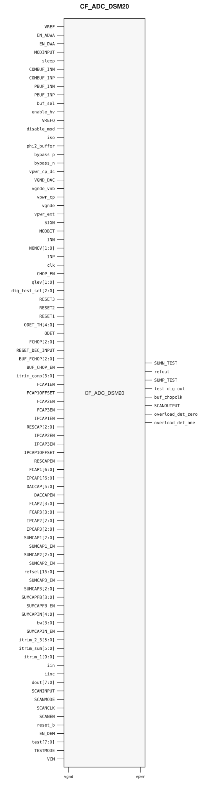

# CF_ADC_DSM20

> Delta-sigma modulator ADC

The public GDS is an abstract; ChipFoundry
substitutes protected full geometry at tapeout.

This package ships an SRAM-style PG wrap `CF_ADC_DSM20` around analog leaf
`CF_ADC_DSM20_core`.

## Overview

`CF_ADC_DSM20` is a SkyWater 130 nm hard-macro delta-sigma modulator ADC. Instantiate `CF_ADC_DSM20`.

Macro size is 952.275 × 616.38 µm (15 µm halo around analog leaf 922.275 × 586.38 µm).
Customer PG for chip PDN is `vpwr` / `vgnd`. Analog supplies stay wrap ports and
are routed as signals.

## Installation

```bash
pip install cf-ipm
ipm install CF_ADC_DSM20 --version 0.2.0
```

Use `hdl/gl/CF_ADC_DSM20.v` as the customer blackbox, `layout/lef/CF_ADC_DSM20.lef`
for P&R, and `layout/gds/CF_ADC_DSM20.gds` / `layout/mag/CF_ADC_DSM20.mag` for the
public wrap. `CF_ADC_DSM20_core` is the analog leaf (empty Verilog, pin-only
abstract). ChipFoundry substitutes vault GDS into `CF_ADC_DSM20_core` at tapeout.
P&R uses the wrap LEF (`vpwr` / `vgnd` for chip PDN).

Functional sim compiles `verify/beh_model/CF_ADC_DSM20_core.v` **instead of** the empty `hdl/gl/CF_ADC_DSM20_core.v` stub. See `verify/beh_model/README.md`.

## Features

- Differential inputs `INP` and `INN`, clock `clk`
- References `VREF`, `VREFQ`, and `VCM`
- Data bus `dout[7:0]`
- Analog supplies `vpwr_cp`, `vpwr_cp_dc`, `vpwr_ext`, `VGND_DAC`, `vgnde`, and `vgnde_vnb`
- Ideal Verilog behavioral model under `verify/beh_model/` for functional sim
- Customer cell `CF_ADC_DSM20` 952.275 × 616.38 µm (15 µm halo around analog leaf 922.275 × 586.38 µm)
- Chip PDN is `vpwr` / `vgnd`

## Pinout

Customer documentation includes a pinout of the integration cell only.
Internal schematics and architecture block diagrams are not published.



Pin names and directions match the public wrap (`layout/lef/CF_ADC_DSM20.lef`)
and the blackbox stub (`hdl/gl/CF_ADC_DSM20.v`).

## Pin Description

Directions and widths are taken from the shipped Verilog in `hdl/gl/CF_ADC_DSM20.v`.

| Name | Direction | Width | Description |
|---|---|---:|---|
| `VREF` | input | 1 | Reference. Route as a signal; not on chip PDN. |
| `EN_ADWA` | input | 1 | Control. Not modeled. |
| `EN_DWA` | input | 1 | Control. Not modeled. |
| `MODINPUT` | input | 1 | Modulator input select. |
| `sleep` | inout | 1 | High clears the ideal model. |
| `COMBUF_INN` | input | 1 | Negative buffer input. |
| `COMBUF_INP` | input | 1 | Positive buffer input. |
| `PBUF_INN` | input | 1 | Negative preamp input. |
| `PBUF_INP` | input | 1 | Positive preamp input. |
| `buf_sel` | input | 1 | Control. Not modeled. |
| `enable_hv` | inout | 1 | Control. Not modeled. |
| `VREFQ` | input | 1 | Quiet reference. Route as a signal; not on chip PDN. |
| `disable_mod` | input | 1 | High disables the modulator in the ideal model. |
| `iso` | inout | 1 | Control. Not modeled. |
| `phi2_buffer` | inout | 1 | Control. Not modeled. |
| `bypass_p` | input | 1 | Control. Not modeled. |
| `bypass_n` | input | 1 | Control. Not modeled. |
| `vpwr_cp_dc` | inout | 1 | Charge-pump DC node. Route as a signal; not on chip PDN. |
| `VGND_DAC` | input | 1 | DAC ground. Route as a signal; not on chip PDN. |
| `vgnde_vnb` | input | 1 | Analog ground well tap. Route as a signal; not on chip PDN. |
| `SUMN_TEST` | output | 1 | Follows INN while the ideal model is running. |
| `vpwr_cp` | input | 1 | Charge-pump supply. Route as a signal; not on chip PDN. |
| `vgnde` | input | 1 | Analog ground. Route as a signal; not on chip PDN. |
| `vgnd` | input | 1 | Ground for chip PDN. |
| `vpwr` | input | 1 | Digital supply for chip PDN. |
| `vpwr_ext` | input | 1 | External analog supply. Route as a signal; not on chip PDN. |
| `refout` | output | 1 | Follows VREF while the ideal model is running. |
| `SUMP_TEST` | output | 1 | Follows INP while the ideal model is running. |
| `test_dig_out` | output | 1 | Digital test observe. Held low in the ideal model. |
| `buf_chopclk` | output | 1 | Chop clock observe. Held low in the ideal model. |
| `SCANOUTPUT` | output | 1 | Follows SCANINPUT when SCANMODE and SCANEN are high. |
| `overload_det_zero` | output | 1 | High in the ideal model when INN is high and INP is low. |
| `overload_det_one` | output | 1 | High in the ideal model when INP is high and INN is low. |
| `SIGN` | input | 1 | Sign control. Not modeled. |
| `MODBIT` | input | 1 | Modulator bit input. Not modeled. |
| `INN` | input | 1 | Negative analog input. |
| `NONOV` | input | 2 | Control. Not modeled. |
| `INP` | input | 1 | Positive analog input. |
| `clk` | input | 1 | Modulator clock. |
| `CHOP_EN` | input | 1 | Chop control. Not modeled. |
| `qlev` | input | 2 | Quantizer level. Not modeled. |
| `dig_test_sel` | inout | 3 | Control. Not modeled. |
| `RESET3` | input | 1 | Reset. The ideal model uses reset_b only. |
| `RESET2` | input | 1 | Reset. The ideal model uses reset_b only. |
| `RESET1` | input | 1 | Reset. The ideal model uses reset_b only. |
| `ODET_TH` | input | 5 | Control. Not modeled. |
| `ODET` | input | 1 | Control. Not modeled. |
| `FCHOP` | input | 3 | Chop control. Not modeled. |
| `RESET_DEC_INPUT` | input | 1 | Reset. The ideal model uses reset_b only. |
| `BUF_FCHOP` | input | 3 | Chop control. Not modeled. |
| `BUF_CHOP_EN` | input | 1 | Chop control. Not modeled. |
| `itrim_comp` | input | 4 | Trim code. Not modeled. |
| `FCAP1EN` | input | 1 | Capacitor or resistor code. Not modeled. |
| `FCAP1OFFSET` | input | 1 | Capacitor or resistor code. Not modeled. |
| `FCAP2EN` | input | 1 | Capacitor or resistor code. Not modeled. |
| `FCAP3EN` | input | 1 | Capacitor or resistor code. Not modeled. |
| `IPCAP1EN` | input | 1 | Capacitor or resistor code. Not modeled. |
| `RESCAP` | input | 3 | Capacitor or resistor code. Not modeled. |
| `IPCAP2EN` | input | 1 | Capacitor or resistor code. Not modeled. |
| `IPCAP3EN` | input | 1 | Capacitor or resistor code. Not modeled. |
| `IPCAP1OFFSET` | input | 1 | Capacitor or resistor code. Not modeled. |
| `RESCAPEN` | input | 1 | Capacitor or resistor code. Not modeled. |
| `FCAP1` | input | 7 | Capacitor or resistor code. Not modeled. |
| `IPCAP1` | input | 7 | Capacitor or resistor code. Not modeled. |
| `DACCAP` | input | 6 | Capacitor or resistor code. Not modeled. |
| `DACCAPEN` | input | 1 | Capacitor or resistor code. Not modeled. |
| `FCAP2` | inout | 4 | Capacitor or resistor code. Not modeled. |
| `FCAP3` | inout | 4 | Capacitor or resistor code. Not modeled. |
| `IPCAP2` | input | 3 | Capacitor or resistor code. Not modeled. |
| `IPCAP3` | input | 3 | Capacitor or resistor code. Not modeled. |
| `SUMCAP1` | input | 3 | Capacitor or resistor code. Not modeled. |
| `SUMCAP1_EN` | input | 1 | Capacitor or resistor code. Not modeled. |
| `SUMCAP2` | input | 3 | Capacitor or resistor code. Not modeled. |
| `SUMCAP2_EN` | input | 1 | Capacitor or resistor code. Not modeled. |
| `refsel` | input | 16 | Reference select. Not modeled. |
| `SUMCAP3_EN` | input | 1 | Capacitor or resistor code. Not modeled. |
| `SUMCAP3` | input | 3 | Capacitor or resistor code. Not modeled. |
| `SUMCAPFB` | input | 4 | Capacitor or resistor code. Not modeled. |
| `SUMCAPFB_EN` | input | 1 | Capacitor or resistor code. Not modeled. |
| `SUMCAPIN` | input | 5 | Capacitor or resistor code. Not modeled. |
| `bw` | input | 4 | Bandwidth code. Not modeled. |
| `SUMCAPIN_EN` | input | 1 | Capacitor or resistor code. Not modeled. |
| `itrim_2_3` | input | 6 | Trim code. Not modeled. |
| `itrim_sum` | input | 6 | Trim code. Not modeled. |
| `itrim_1` | input | 10 | Trim code. Not modeled. |
| `iin` | input | 1 | Bias current. Route as a signal; not on chip PDN. |
| `iinc` | input | 1 | Complement bias current. Route as a signal; not on chip PDN. |
| `dout` | inout | 8 | Ideal data sample. Driven only while the model is running. |
| `SCANINPUT` | input | 1 | Scan data in. |
| `SCANMODE` | input | 1 | Scan mode. |
| `SCANCLK` | input | 1 | Scan clock. Not used by the ideal model. |
| `SCANEN` | input | 1 | Scan enable. |
| `reset_b` | input | 1 | Active-low reset. Low clears the ideal model. |
| `EN_DEM` | input | 1 | Control. Not modeled. |
| `test` | inout | 8 | Test bus. Not driven by the ideal model. |
| `TESTMODE` | input | 1 | Test mode. Not modeled. |
| `VCM` | input | 1 | Common-mode reference. Route as a signal; not on chip PDN. |


`CF_ADC_DSM20_core` also has well taps `vpb` and `vnb`, and digital aliases
`vpwrd` and `vgndd`. The wrap ties `.vpb(vpwr)`, `.vnb(vgnd)`, `.vpwrd(vpwr)`,
and `.vgndd(vgnd)`. Do not connect those pins at chip level.

In OpenLane / LibreLane, hook chip PDN with
`PDN_MACRO_CONNECTIONS: "u_cf_adc_dsm20 vccd1 vssd1 vpwr vgnd"` and connect
`.vpwr(vccd1)`, `.vgnd(vssd1)` under `USE_POWER_PINS`. Route the analog
supplies and the differential inputs onto `analog_io`.

```json
"SYNTH_ELABORATE_ONLY": true,
"SYNTH_USE_PG_PINS_DEFINES": "USE_POWER_PINS",
"FP_PDN_ENABLE_RAILS": false,
"RUN_TAP_ENDCAP_INSERTION": false,
"FP_PDN_HORIZONTAL_HALO": 10,
"FP_PDN_VERTICAL_HALO": 10,
"PDN_MACRO_CONNECTIONS": ["u_cf_adc_dsm20 vccd1 vssd1 vpwr vgnd"],
"MAGIC_EXT_USE_GDS": false,
"MAGIC_EXT_ABSTRACT_CELLS": ["^CF_ADC_DSM20_core$"],
"PRIMARY_GDSII_STREAMOUT_TOOL": "magic",
"MAGIC_MACRO_STD_CELL_SOURCE": "macro",
"MAGIC_CAPTURE_ERRORS": false,
"RUN_MAGIC_DRC": false
```

## Specifications

This macro is the catalog delta-sigma modulator ADC. No Liberty timing file
ships with this package. This README does not invent PVT tables. The ideal
model samples `INP` onto `dout[0]`. It does not perform 12-to-20-bit conversion.

## Timing Diagram

The ideal model in `verify/beh_model/` is the functional timing reference for
simulation. `reset_b` low, `disable_mod` high, or `sleep` high releases `dout`
and clears the observe outputs. On the rising edge of `clk` while running,
`dout` is driven with `INP` in bit 0, `refout` follows `VREF`, and the sum and
overload observes follow `INP` / `INN`. `SCANOUTPUT` follows `SCANINPUT` when
`SCANMODE` and `SCANEN` are high. That model is not silicon-verified.

## Limitations and Open Issues

- Verilog in `hdl/gl/CF_ADC_DSM20.v` is a structural wrap around an empty
  `CF_ADC_DSM20_core` blackbox. Functional sim uses `verify/beh_model/CF_ADC_DSM20_core.v` (ideal model, not SPICE).
- Liberty is not in this package. P&R uses the wrap LEF.
- Trim, capacitor, chop, bandwidth, and decimation behavior are not modeled.
- The ideal model is a 1-bit sample of `INP`, not a configurable 12-to-20-bit converter.

## Release History

| Version | Date | Notes |
|---|---|---|
| 0.2.0 | 2026-09-28 | First SRAM-style PG-wrapped package. Ideal behavioral model. Core fill-exclude covers. |

## Tapeout History

This hard macro has high-volume commercial production history (millions of
units). Catalog and IPM maturity is Production. ChipFoundry substitutes
protected full layout at tapeout. The chipIgnite delivery of this package is
not marked shuttle-proven until a run returns.
